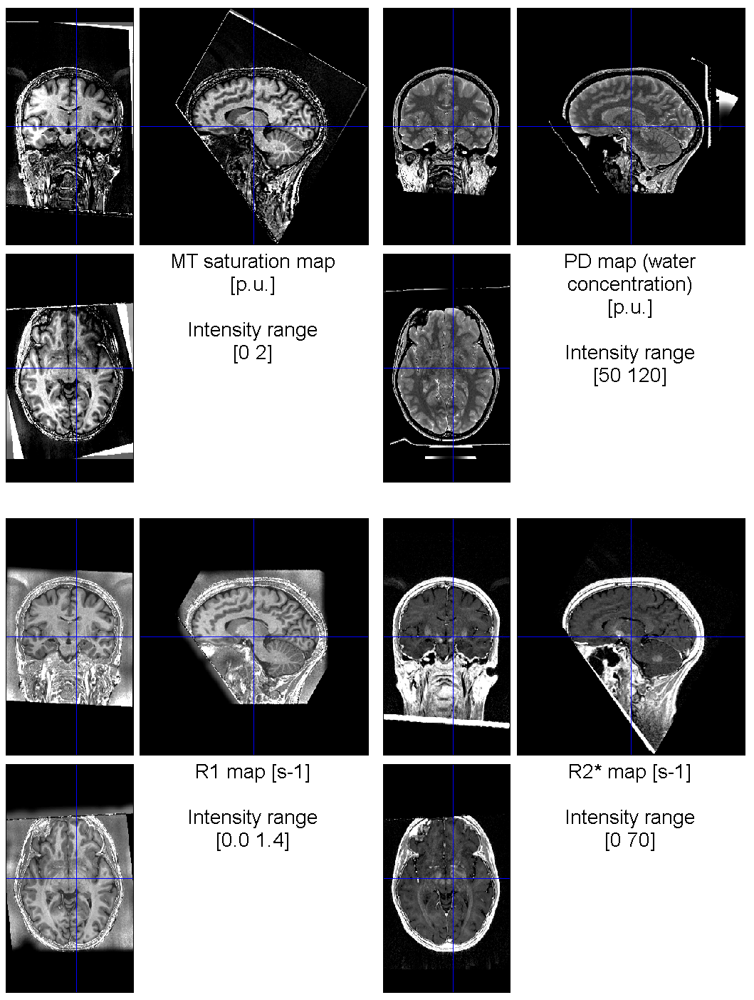
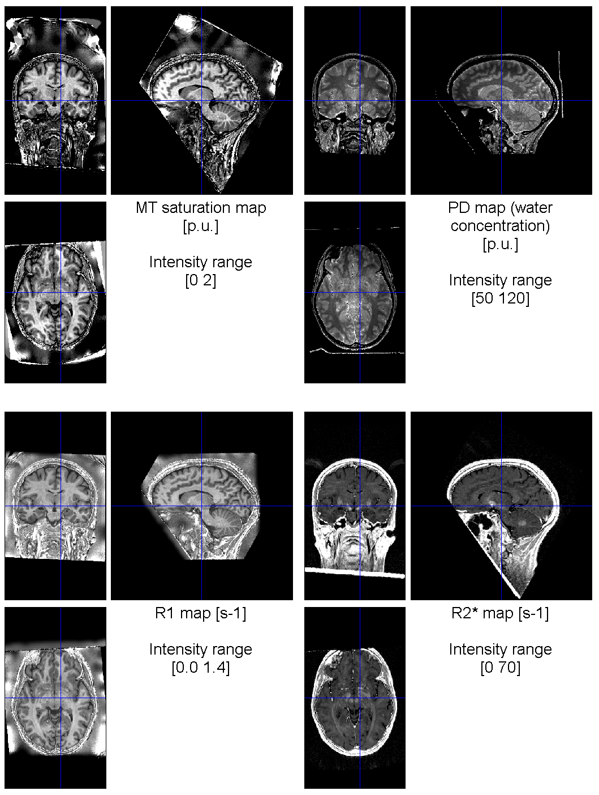

# Map Creation

## Introduction

The `Create hMRI maps` module computes quantitative as well as semi-quantitative estimates of R2\*, R1, PD and MT from
unprocessed multi-echo T1-, PD- and MT-weighted RF-spoiled gradient echo
acquisitions
([Helms2008b](references.md#helms2008b);
[Helms2008a](references.md#helms2008a);
[Weiskopf2013](references.md#weiskopf2013);
[Weiskopf2014](references.md#weiskopf2014)).
The Map creation module corrects the qMRI estimates for spatial [receive](#rf-sensitivity-bias-correction)
and [transmit](#b1-transmit-bias-correction) field inhomogeneities based on additional reference data, if
available
([Lutti2010](references.md#lutti2010);
[Lutti2012](references.md#lutti2012);
[Papp2016](references.md#papp2016)) or using image processing
methods ([Weiskopf2013](references.md#weiskopf2013); [Weiskopf2011](references.md#weiskopf2011)).

## B1+ (Transmit) Bias Correction

The map creation module includes the determination of B1 transmit bias field maps
(*fT* expressed in p.u. of the nominal flip angle) for transmit bias correction
of the quantitative data. Several methods are implemented. Depending on the choice of the
specific method the GUI requires the user to provide adequate input files, which are described below.
For details of the implemented methods we refer the reader to the respective original publications.

### 1. 3D\_EPI

!!! info

    EPI spin-echo (SE)/stimulated-echo (STE)
    method ([Lutti2010](references.md#lutti2010), [Lutti2012](references.md#lutti2012)).

All consecutive pairs of SE/STE images corresponding to the different flip angle nominal values of the SE/STE RF
pulses must be loaded as **B1 input**. B0 field mapping images must also be provided for the correction of
distortions in the EPI images. Both magnitude images and the pre-subtracted phase image must be selected, in that
order, as **B0 input**.

### 2. 3D\_AFI

!!! info

    Actual Flip Angle Imaging (AFI) method ([Yarnykh2007](references.md#yarnykh2007)).

A pair of magnitude images acquired with two different repetition times (TR) must be loaded as **B1 input**. The hMRI
Toolbox then calculates the B1 transmit bias field map as described in [Yarnykh2007](references.md#yarnykh2007).

### 3. tfl\_b1\_map

!!! info

    TFL B1 mapping ([Chung2010](references.md#chung2010)).

For this method, the batch interface requires a pair of images (one anatomical image and one flip angle map, in that
order) from a service sequence by Siemens (version available from VE11 on) based on a turbo flash (TFL) sequence with
and without a pre-saturation pulse ([Chung2010](references.md#chung2010)). The flip angle map used as input contains the
measured
flip angle multiplied by 10. After rescaling (p.u.) and smoothing, the output *fT* map is ready to be used for B1
transmit bias correction.

### 4. rf\_map

The batch interface requires a pair of images output from a service sequence by Siemens (Erlangen, Germany; one
anatomical image and one pre-processed B1 map, in that order) based on the acquisition of a spin-echo/stimulated echo
as used for the 3D\_EPI method above ([Lutti2010](references.md#lutti2010)). Rescaling to an *fT* map (p.u.) suitable
for B1
transmit bias correction from the signal intensity of the preprocessed map from the scanner, *S*, using the nominal
flip angle *alpha* is performed in the toolbox according to the following formula: *fT* = ((*S* - 2048) × 180 ×
100)/(2048 × *alpha*) (source: Siemens Customer Services Knowledge Base, ID: 15480, "Evaluation of RF field (B1)
Inhomogeneity with service sequence RF\_map").

### 5. DAM\_b1\_map

!!! info

    Double Angle Mapping B1 map.

The batch interface requires a pair of images, the first with flip angle 2*alpha and the second with flip angle
alpha (e.g. 120°/60°).
This method can also be used for Saturated Double Angle Mapping (SDAM) data.

### 6. pre-processed B1

Any B1 transmit bias field map precalculated using one of the above methods or another method can be used as
pre-processed **B1 input**. The user must select one anatomical reference (for registration) and one B1 map, in that
order. The anatomical reference is typically a magnitude image from the B1 mapping dataset, and must be in the same
space as the B1 transmit bias field map. If the B1 map is not expressed in percent units (p.u.) of the nominal flip
angle, a scaling factor can be introduced to bring it to the right units.
NOTE: [BIDS-compatible B1 maps](https://bids-specification.readthedocs.io/en/latest/glossary.html#tb1map-suffixes)
have a "B1" value of 1 where the nominal flip angle is achieved. For such B1 map, a scaling factor of 100 will be
needed.

### 7. UNICORT

!!! info

    Data driven estimation of the B1 transmit bias field map using the UNICORT approach ([Weiskopf2011](references.md#weiskopf2011)).

If none of the above-mentioned methods applies because no appropriate B1 transmit bias field mapping data were
acquired, the UNICORT option is recommended to remove the transmit field bias in the R1 map and estimate the B1
transmit bias field map from the qMRI data. UNICORT parameters may need tuning to the specific RF transmit coil used
as it was developed and optimised for Siemens Trio.    
Most importantly, the regularisation parameters must be adapted. The settings will depend on how much non-uniformity
there is in the data. If there is no non-uniformity, then the regularisation should be high. If there is lots, then
there should be less regularisation.

### 8. no\_B1\_correction

With this option, no correction for transmit inhomogeneities is applied, i.e., *fT* = 1.

### Conclusion

For each B1 mapping protocol (1-6), one `*_B1map` (in p.u.) and one `*_B1ref` (for anatomical reference) file is created
and saved in the `Results/Supplementary` directory.
The output images are associated with JSON metadata including the type of B1 map processed and the processing
parameters.
For UNICORT, only the `*_B1map` in p.u. is created (in the same space as the qMRI maps) with no anatomical reference.
Default acquisition and processing parameters for the UNICORT, 3D\_EPI and 3D\_AFI methods can be customised at this
point by providing the module with a customised configuration file (see
section [Default parameters and customization of the toolbox](defaultsAndCustomization.md) for examples and guidelines).

Except for UNICORT, where the B1 transmit bias field directly derived from the qMRI data, and the `no_B1_correction`
option, where no anatomical reference is needed, the hMRI Toolbox co-registers the anatomical image with the multi-echo
RF-spoiled gradient echo data before applying the B1 transmit bias correction.

## RF Sensitivity Bias Correction

Four options are available to address RF sensitivity bias within the `Create hMRI maps` module: (1) no correction, (2)
Unified Segmentation (US), (3) use one measured RF sensitivity map, (4) use three measured RF sensitivity maps, one per
contrast.
While options (2) and (3) assume that the sensitivity profile is consistent between contrasts (i.e. small inter-contrast
subject movement), option (4) accounts for inter-contrast variation in RF sensitivity profile due to larger subject
motion ([Papp2016](references.md#papp2016),[Balbastre2022](references.md#balbastre2022)).
Measured RF sensitivity maps methods (options 3,4) are preferred over data-driven US methods (option 2) for bias
correction.
The option of using no RF sensitivity bias correction (option 1) is not recommended.

### Receive Field Sensitivity Measurements

#### Body and Head Coil Measurements ([Papp2016](references.md#papp2016))

The underlying assumption of this method is that the receive field sensitivity of the body coil is much flatter than
that of an array head coil.
Thus, if the anatomy is imaged with the head coil and the body coil sequentially, using the same acquisition parameters
and assuming no motion, then the ratio of these two scans is the net head coil receive sensitivity field *fR* divided by
a sensitivity field close to a constant.

If receive field sensitivity measurements are available for each imaging contrast (one receive sensitivity field
acquired either before or after each of the PDw, T1w and MTw contrasts), inter-scan variation of the sensitivity
modulation can be accounted for and used to optimally correct for the combined inter-scan motion and sensitivity
modulation effects in the quantitative maps.
Therefore, the implemented RF sensitivity correction method (`Per contrast` option) combines the correction for
motion-related relative receive sensitivity variations with rigid body realignment.

The low resolution measurements from the head and body coils (in this order) for each T1w, PDw and MTw acquisition are
expected as inputs to the RF sensitivity bias correction. A receive field sensitivity map is calculated for each
contrast, and applied to the corresponding contrast to correct for any coil sensitivity driven signal intensity
modulation.

If RF sensitivity measurements are missing for some of the contrasts, or if only one single measurement is available,
the same RF sensitivity bias correction can still be applied to all contrasts by choosing the corresponding `Single`
option in the GUI.
Only one pair of head coil and body coil images is then required.
Receiver field inhomogeneities will be corrected for although not accounting for inter-scan motion.

Note that the measured RF sensitivity maps will still suffer from residual variations associated with the
field-inhomogeneities of the body coil.
Because of this, this method is followed by an application of the Unified Segmentation approach to minimise the residual
modulation due to the body coil RF sensitivity field.

#### Only Head Coil Measurements ([Balbastre2022](references.md#balbastre2022))

In cases where body coil images are not available or cannot be measured (e.g. at 7T where many scanners do not have a
body coil), it is still possible to correct for the inter-scan variation of the sensitivity modulation.
This is achieved by measuring a low resolution image with the same acquisition parameters before each contrast.
After choosing the `Per contrast` option, each "head coil" image should be the per-contrast low resolution image, and
the "body coil" images should all be the low resolution image measured before the PDw acquisition.

As in the previous case, the measured RF sensitivity maps will suffer from residual variations associated with the
field-inhomogeneities of the head coil.
Because of this, this method is followed by an application of the Unified Segmentation approach to minimise the residual
modulation due to the body coil RF sensitivity field.

### Data Driven Receive Field Estimation.

If no receive field sensitivity map has been acquired, the `Unified Segmentation` option can be selected in the GUI.
The receive field bias is then estimated from the calculated A map using the Unified Segmentation
approach ([Ashburner2005](references.md#ashburner2005)). Accurate bias field estimation requires the use of a brain mask combining the
white and grey matter probability maps. The latter are derived by segmentation of the calculated MT map (because of its
higher contrast in the basal ganglia ([Helms2009](references.md#helms2009)) or alternatively (if no MTw images are available), by
segmentation of the calculated R1 map. The method may require tuning for the specific head RF receive coil and its
sensitivity profile.

## Imperfect Spoiling Correction

The proposed MPM protocol uses RF and gradient spoiling to destroy unwanted transverse magnetisation. Imperfect spoiling
can leave residual bias in the apparent R1 map if no further correction is
used ([Preibisch and Deichmann 2009](references.md#preibisch2009)). For specific MPM protocols using the customised sequences, the hMRI
Toolbox provides spoiling correction coefficients to account for deviation from the Ernst equation. The coefficients are
sequence-specific and can be determined by simulation ([Preibisch and Deichmann 2009](references.md#preibisch2009)). Further refinements
of this correction include diffusion effects on signal spoiling 
([Yarnykh2007](references.md#yarnykh2007), 
[Lutti2012](references.md#lutti2012), 
[Callaghan2015b](references.md#callaghan2015b)).
By default, this correction is disabled but can be enabled through
the [toolbox customisation](defaultsAndCustomization.md#imperfect-rf-spoiling-correction).

A module that efficiently calculates the protocol-specific correction parameters required to account for imperfect
spoiling may be found within the toolbox.
See [Corbin2021](references.md#corbin2021) for guidance on calculation including the choice of T2 time and the moment of the spoiler
gradients and the diffusion-spoiling effects of the readout.

## MPM Model to Estimate R2\*, PD, R1 & MT Maps

The signal from the multi-echo PDw, T1w and MTw echoes is modelled by the Ernst
equation ([Ernst1966](references.md#ernst1966),
[Helms2008a](references.md#helms2008a),
[Helms2008b](references.md#helms2008b)) with an exponential decay with
echo time (TE).

The effective transverse relaxation rate R2\* is derived from the exponential TE dependence of the signal. The unified
description of the multi-echo data from two or more contrasts into a single signal model, denoted as
ESTATICS ([Weiskopf2014](references.md#weiskopf2014)), provides a more robust estimation of R2\* with a higher signal-to-noise ratio (
SNR). The toolbox provides several estimation methods including log-linear ordinary least squares (OLS; the original
ESTATICS method), log-linear weighted least squares (WLS; a little slower than ordinary least squares but accounts for
the heteroskedasticity induced by the logarithm) and nonlinear least squares (NLLS; very slow but homoskedastic). For
backwards compatibility OLS is used by default, but this can be changed in
the [toolbox defaults file](defaultsAndCustomization.md#create-hmri-maps-parameters).

Using approximations of the signal equations for small repetition time (TR), the longitudinal relaxation rate (R1) and
the A map (proportional to the proton density PD) can be efficiently estimated from the PDw and T1w
data ([Helms2008a](references.md#helms2008a),[Edwards2021](references.md#edwards2021)).
Using the additional assumption of a small excitation flip
angle for the MTw data, the magnetisation transfer (MT) saturation can be estimated from the R1 and A maps and the MTw
data ([Helms2008b](references.md#helms2008b)).
By default, the small angle approximation is also assumed when computing R1 and A maps,
but this can be changed in the [toolbox defaults file](defaultsAndCustomization.md#create-hmri-maps-parameters).

The toolbox provides flexible correction methods for transmit (*fT*) and receive (*fR*) bias fields based on specific B1
transmit and receive fields measurements or image processing methods. While *fT* influences the local apparent flip
angle and hence all three (R1, A, MT) maps, the RF sensitivity bias field *fR* only influences the A map. Rescaling of
the A map to a PD map (with mean white matter PD of 69%) is performed when sufficient data are available to account for
R2\* decay ([Balteau2018](references.md#balteau2018)) and *fT* and *fR* biases.

The toolbox can also handle the situation where only a subset of data is available. For example, R2\*, R1 and PD can
still be estimated when no MTw data are available, and R2\* alone can be estimated when no MTw nor T1w echoes are
available (i.e. only multi-echo PDw data are available).

## Output Files

By default, the estimated quantitative maps are output into a `Results` subdirectory within the folder of the first
PD-weighted echo. Alternatively, a user-defined folder for the output of the toolbox can be selected where the `Results`
directory will be created. The main estimated qMRI maps are saved in the specified output directory while supplementary
files are output in the `Results/Supplementary` subfolder. The basename for all qMRI maps is derived from the first echo
of the PD-weighted image series, see below for a brief description. If the data are reprocessed, a new sub-folder is
created.

### Cleanup Options and Temporary Directories

During data processing, many files are created that are of no interest for the end-user. Only maps, images and log files
of interest for further statistical analysis and quality control are stored in the `Results` directory and subdirectory.
The temporary files can be of great value for piloting and debugging purposes though. They're convenient if one desires
have a closer look at the intermediate processing steps to e.g. spot the origin of an artefact.

The temporary folders are created at the same location as the `Results` directory. They include:

- RFsensCalc: to process [(measured) RF sensitivity data](#receive-field-sensitivity-measurements) and
  apply [RF sensitivity bias correction](#rf-sensitivity-bias-correction) to the original images.
- B1mapCalc: to process B1 mapping data for [B1 transmit bias correction](#b1-transmit-bias-correction).
- MPMCalc: to generate the quantitative maps R1, R2\*, PD and MT (or part of them, depending on the input).

The default parameter `hmri_def.cleanup` can be [customized](defaultsAndCustomization.md#examples). By default, it is set
to `false`. All temporary directories will be deleted when the *Create hMRI maps* module has completed (recommended to
save disk space). 

!!! warning

    Reminder for [toolbox customization](defaultsAndCustomization.md): never modify the defaults files
    located at the root of the `config` directory. Instead, use one of the template defaults files from `config/local` and
    save it under a meaningful name.

### Example of outputs from the *Create hMRI maps* module

*Output files from the Create hMRI maps module using the SE/STE B1 mapping and per-contrast RF sensitivity bias
correction.*

#### `Results directory` > Description

- `<firstPDfileName>_MT.[nii|json]` > Estimated magnetisation transfer map in p.u.
- `<firstPDfileName>_PD.[nii|json]` > Estimated proton density PD map in p.u.
- `<firstPDfileName>_R1.[nii|json]` > Estimated longitudinal relaxation rate R1 map in s^-1
- `<firstPDfileName>_R2s_<R2sMethod>.[nii|json]` > Estimated transversal relaxation rate R2\* map in s^-1 (ESTATICS),
  where `<R2sMethod>` is the R2\* fitting method (e.g. `OLS` or `WLS1`;
  see [Create hMRI maps parameters](defaultsAndCustomization.md#create-hmri-maps-parameters)).

#### `Results/Supplementary directory` > Description

- `hMRI_map_creation_rfsens_params.json` > RF sensitivity bias correction parameters (measured sensitivity maps)
- `hMRI_map_creation_b1map_params.json` > B1 transmit map estimation: acquisition and processing parameters
- `hMRI_map_creation_job_create_maps.json` > Create hMRI maps: acquisition and processing parameters
- `hMRI_map_creation_mpm_params.json` > Acquisition and processing parameters used for the current job
- `hMRI_map_creation_quality_assessment.json` > Quality assessment results
- `<firstSESTEfileName>_B1map.[nii|json]` > Estimated B1 bias field *fT* map (p.u.)
- `<firstSESTEfileName>_B1ref.[nii|json]` > Anatomical reference for B1 bias field correction
- `<firstPDfileName>_MTw_<R2sMethod>fit_TEzero.[nii|json]` > MTw echoes extrapolated to TE=0, where `<R2sMethod>` is the
  R2\* fitting method
- `<firstPDfileName>_PDw_<R2sMethod>fit_TEzero.[nii|json]` > PDw echoes extrapolated to TE=0, where `<R2sMethod>` is the
  R2\* fitting method
- `<firstPDfileName>_R2s.[nii|json]` > Estimated R2\* map from simple exponential fit (PDw echoes)
- `<firstPDfileName>_T1w_<R2sMethod>fit_TEzero.[nii|json]` > T1w echoes extrapolated to TE=0, where `<R2sMethod>` is the
  R2\* fitting method

## Batch options

Help on batch options is automatically generated from the toolbox config files. The information is collected in
the [Help](helpScripts.md#create-hmri-maps) section.

## Setting up local defaults

Since acquisition parameters as well as processing parameters can be site- and scanner-dependent, the defaults must be
customizable. This topic is extensively described in
section ["Default parameters and customization of the toolbox"](defaultsAndCustomization.md).

## Example

This example will take you step-by-step through the processing (map creation part) of the hMRI demo dataset
available [here][hMRI-dataset-zip-to-download]. Unless specified, default settings should be left unchanged. See
the [Debug tips & tricks](debugMetadataAndLogFiles.md#visual-inspection-of-the-created-maps) section for tips about
displaying the created maps for visual inspection.

#### Set up and Run the Map Creation Module

1. Download and unzip the hMRI demo dataset within a `data` directory on your hard drive.
2. Create a `derivative` directory to store processing results.
3. Start SPM (`spm fmri`) and open the Batch GUI (`Batch` button in the SPM Menu window).
4. Go to `SPM` > `Tools` > `hMRI Tools` > `Create hMRI maps` (Batch GUI).
5. In `Output choice`, select `Output directory` and specify the newly created `derivative` directory as output
   directory.
6. In `B1 bias correction` > `B1 input`, select all the volumes found in `mfc_seste_b1map_v1e_0004` (keep alphabetical
   order).
7. In `B1 bias correction` > `B0 input`, select all the volumes found in `gre_field_mapping_1acq_rl_0005`
   and `gre_field_mapping_1acq_rl_0006` (in that order).
8. In `Multiparameter input images` > `MT images`, select all the volumes found in `mtw_mfc_3dflash_v1i_R4_0012` (keep
   alphabetical order).
9. In `Multiparameter input images` > `PD images`, select all the volumes found in `pdw_mfc_3dflash_v1i_R4_0009` (keep
   alphabetical order).
10. In `Multiparameter input images` > `T1 images`, select all the volumes found in `t1w_mfc_3dflash_v1i_R4_0015` (keep
    alphabetical order).
11. Save and run the batch.

#### Note on Pop-up Messages and Warnings

By default, any information or warning considered potentially critical for the processing of your data will be displayed
in a pop-up window, blocking the execution of the code. This is obviously rather annoying if you intend to process a
bunch of data over night ;)! It can be disabled (see the Batch option "Pop-up warnings") for that purpose. For piloting
data processing though (e.g. processing a single-subject dataset to check everything is generated as expected), it is
recommended to keep the pop-up option enabled, so you can read through and acknowledge every message and make sure
everything is set up properly before running the processing on a whole group.

Warning messages are only meant to make you aware of some of the processing steps and parameters used to generate the
maps. And to give you a chance to decide whether these processing steps and parameters are definitely the right ones for
the data you have at hand. Most warning and information messages are listed in
the [Debug tips & tricks](debugMetadataAndLogFiles.md#processing-message-log-files) section, with a description of
potential implications and actions to be taken.

#### Results Description

The four maps generated (MT, PT, R2s and R1) will be found in `derivative/Results`. These maps are the relevant ones for
statistical analysis (see section on [Map Processing](processing.md)). In `derivative/Results/Supplementary` are stored the
processing parameters and various additional images. Given the strong inter-scan motion factor in the dataset (affecting
the MTw data, see details [here](hmriDemoDataset.md)), the MT map is strongly affected by artefacts. The R2\* map is not
affected by such inter-scan motion, although including data input from all three contrasts (PDw, T1w and MTw). The PD
and R1 maps do not rely on the MTw data and do not suffer from the same inhomogeneity. In addition, the PD map is
corrected for RF sensitivity bias by applying the US algorithm.

#### Alternative Processing - More Robust RF Sensitivity Bias Correction

By default, (as used in the above step-by-step description), when no RF sensitivity data are available, Unified
Segmentation is used to estimate the Bias Field related to the receiver field profile. If RF sensitivity data are
available (as is the case in the hMRI demo dataset), a more robust and especially more motion-insensitive correction can
be applied. The following steps are to be taken in addition to the ones described above:

- In `RF sensitivity bias correction`, select `Per contrast`. This indicates that one RF sensitivity dataset has been
  acquired per contrast, i.e. for each of the MTw, PDw and T1w series. One separate RF sensitivity dataset will be
  required for each contrast. With such data, the corresponding RF sensitivity data will better account for inter-scan
  movements of the subject, making the RF sensitivity bias correction more robust to such movements.
- In `RF sensitivity bias correction` > `Per contrast` > `RF sensitivity maps for MTw images`, select the volumes found
  in `mfc_smaps_v1a_Array_0010` and `mfc_smaps_v1a_QBC_0011` (in that order).
- In `RF sensitivity bias correction` > `Per contrast` > `RF sensitivity maps for PDw images`, select the volumes found
  in `mfc_smaps_v1a_Array_0007` and `mfc_smaps_v1a_QBC_0008` (in that order).
- In `RF sensitivity bias correction` > `Per contrast` > `RF sensitivity maps for T1w images`, select the volumes found
  in `mfc_smaps_v1a_Array_0013` and `mfc_smaps_v1a_QBC_0014` (in that order).
- Save and run the batch.

#### *Better* Results Description

Thanks to the per-contrast RF sensitivity maps used for RF sensitivity bias correction, motion artefacts observed
previously are strongly reduced (see MT map in particular). However, the RF sensitivity maps are not fully bias-free
themselves! The RF sensitivity maps are calculated assuming that the body coil sensitivity profile in homogeneous, which
is usually not the case on modern 2-channel body coils. Therefore, the calculated RF sensitivity maps are modulated by
the body coil RF sensitivity profile, which will be visible on the calculated PD maps in particular. Overall, the
improvement in terms of scan-rescan reproducibility and inter-scan motion insensitivity observed with the `Per contrast`
option is still worth the hassle of acquiring and using such data.

[hmri-defaults]: {{config.repo_url}}/blob/master/config/hmri_defaults.m
[hmri-defaults-local]: {{config.repo_url}}/blob/master/config/local/hmri_defaults_local.m
[hmri-get-defaults]: {{config.repo_url}}/blob/master/hmri_get_defaults.m
[hMRI-dataset-zip-to-download]: hmriDemoDataset.md
